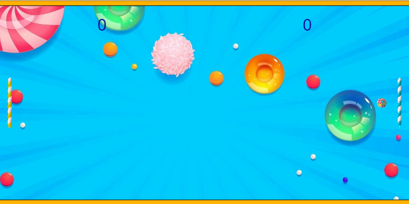

<h1 align="center"> Construyendo el Juego Pong </h1>

<h1 align="center"> Front End G6 - ONE </h1>

<h1 align="center"> Curso de ChatGPT y JavaScript:Construyendo el Juego Pong </h1>
 
👩‍💻 💻 Desarrollo del proyecto  Juego Pong: "Realizado con ChatGPT y JavaScript. "   

Realice este curso para Lógica de Programación: 
* Conocer ChatGPT.
* Comprender cómo utilizar la herramienta de inteligencia artificial como herramienta de apoyo a los estudios.
* Cree un proyecto utilizando la herramienta p5.js. 
* Aprendi a crear mensajes asertivos para generar respuestas adaptadas a mis necesidades.
* Aplique Texto a voz a el proyecto para narrar la puntuación del partido.
* La combinación de p5.js y ChatGPT nos brinda un conjunto de herramientas poderosas para crear experiencias interactivas que combinan sonido y texto de manera innovadora.
* Este curso da la base para una persona desarrolladora que necesitará a lo largo de su vida profesional, hacer estas solicitudes con ChatGPT lo que le permitira ampliar sus conocimientos por medio de esta IA.

 

     
     

        

 
  ❤️ ESTADO: Finalizado
 

## 🔎 Deploy

  <h3>
    <a href="https://editor.p5js.org/bety2022/full/RrKL7QFlr" >
      🔗 Visitar el Juego Pong
    </a>

 

## 🛠️ Herramientas implementadas 
  - ChatGPT
  - p5.js
  - API
  - HTML
  - Sprites
  - Prompts
  - JavaScript
  - Herramienta Text to Speech
  - Git || GitHub || GitHub Pages

    

 

 

## 📧 Contacto
¿Tienes un proyecto en mente? Conectémonos y hagamos que las cosas sucedan! Puedes escribirme a carolinalopezdatascientist@gmail.com o seguirme en [LinkedIn](https://www.linkedin.com/in/carolina-lopez-430208106/).
  
